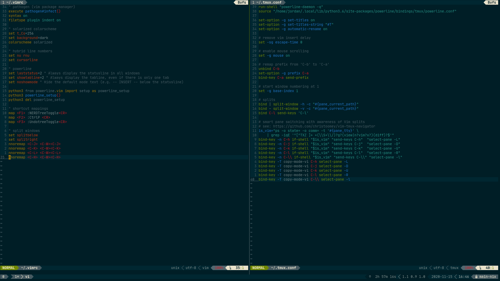

# Dev Environment Config

Config files and command-line utilities

## [Bash](https://www.gnu.org/software/bash)

Config for several command-line utilities:

```sh
$ ln -s .dircolors $HOME/.dircolors
$ ln -s branch-win-title.sh $HOME/.local/bin/branch-win-title.sh
$ ln -s .xprofile $HOME/.xprofile
$ ln -s .profile $HOME/.profile
$ source $HOME/.profile
```

Command-line utils:

- [sdkman](https://github.com/sdkman/sdkman-cli)
- [nvm](https://github.com/nvm-sh/nvm)
- [pyenv](https://github.com/pyenv/pyenv)
- [Smart Caps Lock](https://gist.github.com/tanyuan/55bca522bf50363ae4573d4bdcf06e2e)
- [Git branch in win title](https://github.com/j4ckofalltrades/git-branch-win-title)

## [Powerline](https://github.com/powerline/powerline)

Powerline config (for bash, tmux, and vim) with several plugins listed below, setup with:

`$ ln -s config/powerline $HOME/.config/powerline`

Plugins:

- [powerline-gitstatus](https://github.com/jaspernbrouwer/powerline-gitstatus)
- [powerline-docker](https://github.com/adrianmo/powerline-docker)
- [powerline-k8s](https://github.com/j4ckofalltrades/powerline-k8s)

## [Git](https://git-scm.com)

gitconfig with command aliases:

`$ ln -s .gitconfig $HOME/.gitconfig`

## [Vim](https://github.com/vim/vim)

Vim config with several plugins, setup with:

```sh
$ git submodule update --init
$ ln -s .vim $HOME/.vim
$ ln -s .vim/.vimrc $HOME/.vimrc
$ vi $HOME/.vimrc # then execute 'source vim/.vimrc'
```

Plugins:

- [NERDTree](https://github.com/preservim/nerdtree)
- [CtrlP](https://github.com/kien/ctrlp.vim)
- [Undotree](https://github.com/mbbill/undotree)
- [Vim Tmux Navigator](https://github.com/christoomey/vim-tmux-navigator)

## [Tmux](https://github.com/tmux/tmux)

Tmux configuration that plays well with Vim, setup with:

```sh
$ ln -s .tmux $HOME/.tmux
$ ln -s .tmux/.tmux.conf $HOME/.tmux.conf
$ tmux source $HOME/.tmux.conf
```

Plugins:

- [tmux-plugin-manager](https://github.com/tmux-plugins/tpm)
- [tmux-yank](https://github.com/tmux-plugins/tmux-yank)
- [tmux-resurrect](https://github.com/tmux-plugins/tmux-resurrect)
- [tmux-continuum](https://github.com/tmux-plugins/tmux-continuum)

## Colorscheme

- [Solarized](https://github.com/altercation/solarized)
- [Solarized Color Theme for GNU ls](https://github.com/seebi/dircolors-solarized)
- [Solarized Colorscheme for Guake](https://github.com/coolwanglu/guake-colors-solarized)
- [Solarized Colorscheme for Vim](https://github.com/altercation/vim-colors-solarized)

Setup with:

```sh
# solarized colors for guake
$ git clone https://github.com/coolwanglu/guake-colors-solarized.git \
    && cd guake-colors-solarized \
    && ./set_dark solarized
```

## Touchpad Gestures

### Swipe Gestures

| Gesture              | Command                        |  Action               |
| -------------------- | ------------------------------ | --------------------- |
| 3-finger swipe up    | xdotool key super      	| Show all windows      |
| 3-finger swipe down  | xdotool key super     		| Close Exposé          |
| 3-finger swipe left  | xdotool key alt+Right 		| Back (Browser nav)    |
| 3-finger swipe right | xdotool key alt+Left  		| Forward (Browser nav) |
| 4-finger swipe up    | xdotool key control+super+Down	| Next Desktop 	        |
| 4-finger swipe down  | xdotool key control+super+Up   | Previous Desktop      |

### Pinch Gestures

| Gesture   | Command                   | Action   |
| --------- | ------------------------- | -------- |
| Pinch in  | xdotool key control+Plus  | Zoom in  |
| Pinch out | xdotool key control+Minus | Zoom out |

Configure touchpad gestures with [libinput-gestures](https://github.com/bulletmark/libinput-gestures), setup with:

`ln -s config/libinput-gestures.conf $HOME/.config/libinput-gestures.conf`

## Screenshots


